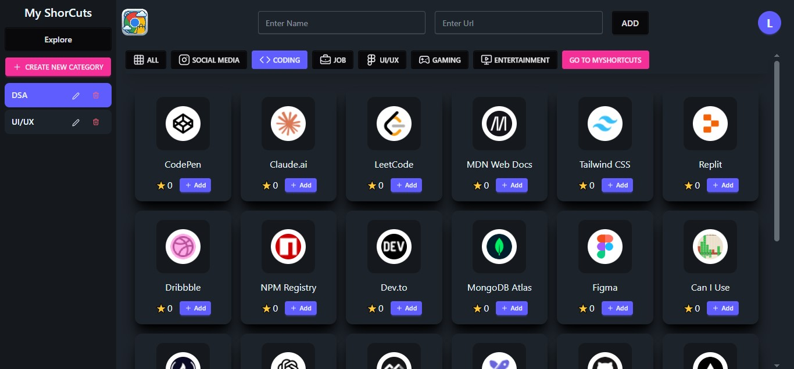
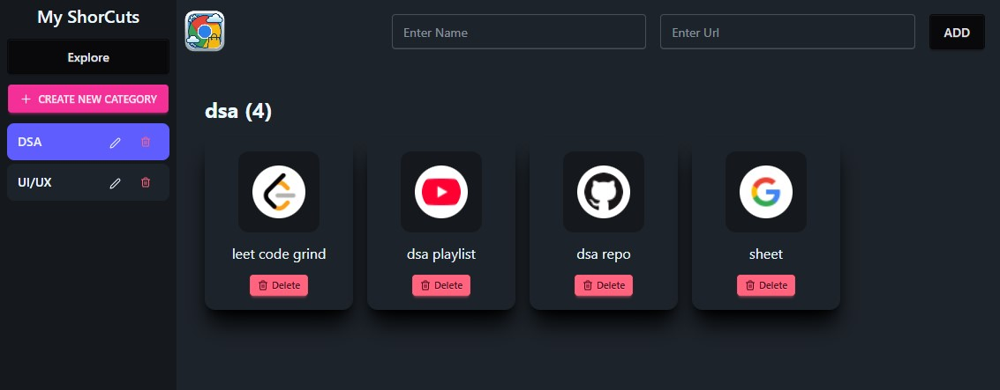
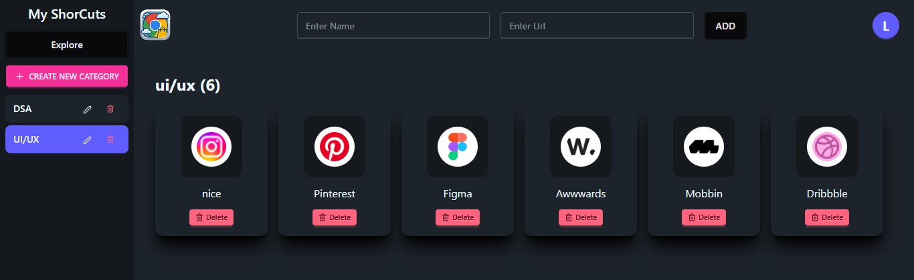

# Chrome Web Store 🚀

A modern MERN stack application that serves as your personal app store for websites. Organize, categorize, and access your favorite websites in one central hub with one-click shortcut creation.

[](https://chrome-web-store.vercel.app)
[](LICENSE)

## 📸 Screenshots

<!-- Add your screenshots here -->
<div align="center">
  
  <p><em>Homepage - Browse categorized websites</em></p>
  
  
  <p><em>Organized by categories</em></p>
  
  
  <p><em>One-click shortcut creation</em></p>
  
  <!-- 
  <p><em>Add custom shortcuts</em></p> -->
</div>

## ✨ Features

### Core Features
- 🎯 **One-Click Shortcuts** - Add website shortcuts instantly with a single click
- 📁 **Smart Categorization** - Organize websites into custom groups and categories
- ➕ **Custom Shortcuts** - Create personalized shortcuts for any website
- 🎨 **Intuitive Interface** - Clean, user-friendly design inspired by app stores
- 🔍 **Quick Search** - Find your saved websites instantly
- 📱 **Responsive Design** - Works seamlessly on desktop, tablet, and mobile devices

### User Experience
- ⚡ Fast and lightweight
- 🔐 Secure user authentication
- 💾 Persistent data storage
- 🎭 Beautiful UI/UX design
- 🌐 Cross-platform compatibility

## 🛠️ Tech Stack

### Frontend
- **React.js** - UI library for building interactive interfaces
- **React Router** - Navigation and routing
- **Axios** - HTTP client for API requests
- **CSS3** - Modern styling and animations

### Backend
- **Node.js** - JavaScript runtime environment
- **Express.js** - Fast, minimalist web framework
- **MongoDB** - NoSQL database for flexible data storage
- **Mongoose** - MongoDB object modeling

### DevOps & Deployment
- **Vercel** - Hosting platform
- **MongoDB Atlas** - Cloud database

## 📋 Prerequisites

Before you begin, ensure you have the following installed:
- Node.js (v14.0.0 or higher)
- npm or yarn
- MongoDB (local installation or MongoDB Atlas account)
- Git

## 🚀 Getting Started

### Installation

1. **Clone the repository**
   ```bash
   git clone https://github.com/codewithmrkay/chrome-web-store.git
   cd chrome-web-store
   ```

2. **Install Backend Dependencies**
   ```bash
   cd backend
   npm install
   ```

3. **Install Frontend Dependencies**
   ```bash
   cd ../frontend
   npm install
   ```

### Configuration

1. **Backend Environment Variables**
   
   Create a `.env` file in the `backend` directory:
   ```env
   PORT=5000
   MONGODB_URI=your_mongodb_connection_string
   JWT_SECRET=your_jwt_secret_key
   NODE_ENV=development
   ```

2. **Frontend Environment Variables**
   
   Create a `.env` file in the `frontend` directory:
   ```env
   REACT_APP_API_URL=http://localhost:5000/api
   ```

### Running the Application

1. **Start the Backend Server**
   ```bash
   cd backend
   npm start
   ```
   The backend server will run on `http://localhost:5000`

2. **Start the Frontend Development Server**
   ```bash
   cd frontend
   npm start
   ```
   The frontend will run on `http://localhost:3000`

3. **Access the Application**
   
   Open your browser and navigate to `http://localhost:3000`

## 📁 Project Structure

```
chrome-web-store/
├── backend/
│   ├── config/
│   │   └── db.js
│   ├── controllers/
│   │   ├── authController.js
│   │   └── shortcutController.js
│   ├── models/
│   │   ├── User.js
│   │   └── Shortcut.js
│   ├── routes/
│   │   ├── auth.js
│   │   └── shortcuts.js
│   ├── middleware/
│   │   └── auth.js
│   ├── server.js
│   └── package.json
│
├── frontend/
│   ├── public/
│   ├── src/
│   │   ├── components/
│   │   │   ├── Navbar.js
│   │   │   ├── ShortcutCard.js
│   │   │   ├── CategoryList.js
│   │   │   └── AddShortcut.js
│   │   ├── pages/
│   │   │   ├── Home.js
│   │   │   ├── Login.js
│   │   │   ├── Register.js
│   │   │   └── Dashboard.js
│   │   ├── services/
│   │   │   └── api.js
│   │   ├── App.js
│   │   └── index.js
│   └── package.json
│
├── screenshots/
├── .gitignore
└── README.md
```

## 🎯 Usage

### Adding a Quick Shortcut
1. Navigate to the homepage
2. Browse available websites
3. Click the "Add" button on any website card
4. The shortcut is instantly saved to your collection

### Creating a Custom Shortcut
1. Click on "Add Custom Shortcut" button
2. Enter the website name
3. Provide the URL
4. Select or create a category
5. Click "Save" to add your custom shortcut

### Organizing by Categories
1. Access the categories section
2. Create new categories for better organization
3. Drag and drop shortcuts between categories
4. Edit or delete categories as needed

## 🔧 API Endpoints

### Authentication
- `POST /api/auth/register` - Register new user
- `POST /api/auth/login` - User login
- `GET /api/auth/user` - Get current user

### Shortcuts
- `GET /api/shortcuts` - Get all shortcuts
- `GET /api/shortcuts/:id` - Get single shortcut
- `POST /api/shortcuts` - Create new shortcut
- `PUT /api/shortcuts/:id` - Update shortcut
- `DELETE /api/shortcuts/:id` - Delete shortcut

### Categories
- `GET /api/categories` - Get all categories
- `POST /api/categories` - Create new category
- `PUT /api/categories/:id` - Update category
- `DELETE /api/categories/:id` - Delete category

## 🤝 Contributing

Contributions are what make the open-source community such an amazing place to learn, inspire, and create. Any contributions you make are **greatly appreciated**.

1. Fork the Project
2. Create your Feature Branch (`git checkout -b feature/AmazingFeature`)
3. Commit your Changes (`git commit -m 'Add some AmazingFeature'`)
4. Push to the Branch (`git push origin feature/AmazingFeature`)
5. Open a Pull Request

## 📝 License

This project is licensed under the MIT License - see the [LICENSE](LICENSE) file for details.

## 👨‍💻 Author

**codewithmrkay**

- GitHub: [@codewithmrkay](https://github.com/codewithmrkay)
- Website: [chrome-web-store.vercel.app](https://chrome-web-store.vercel.app)

## 🙏 Acknowledgments

- Inspired by Google Chrome Web Store
- Icons from [Lucide Icons](https://lucide.dev/)
- UI Design inspiration from modern app stores

## 📞 Support

If you have any questions or need help, feel free to:
- Open an issue on GitHub
- Contact me through my GitHub profile

## 🗺️ Roadmap

- [ ] Add browser extension support
- [ ] Implement sharing functionality
- [ ] Add dark mode theme
- [ ] Enable collaborative categories
- [ ] Add export/import functionality
- [ ] Implement advanced search filters
- [ ] Add website preview thumbnails
- [ ] Create mobile app version

---

<div align="center">
  Made with ❤️ by codewithmrkay
  
  ⭐ Star this repo if you find it helpful!
</div>